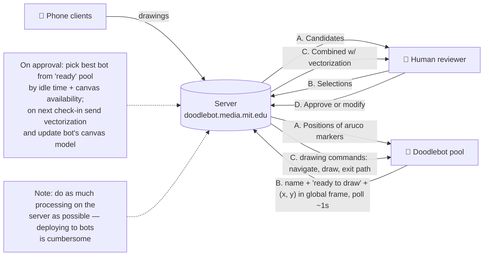
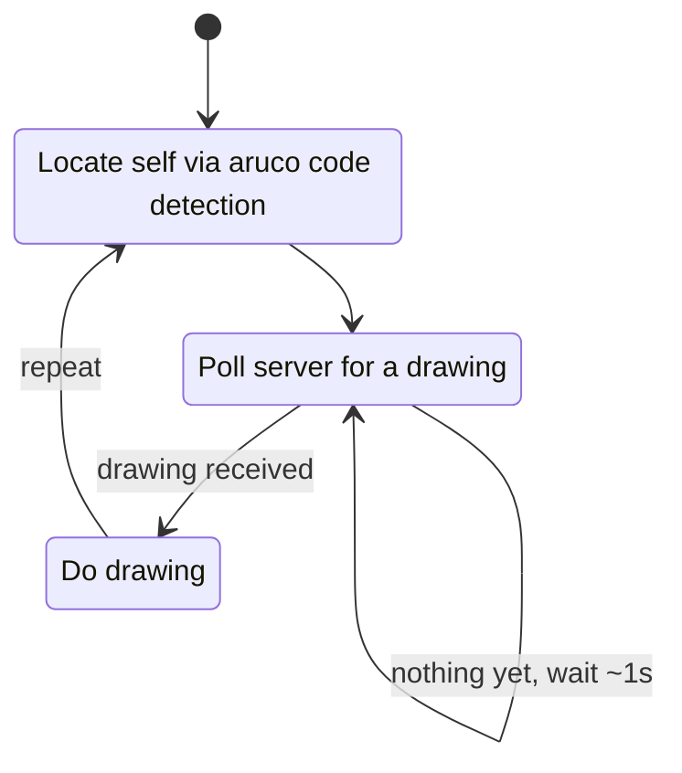

# doodlebot-ai-live

**Main architecture (data flow):**

```mermaid
flowchart LR
    Phones["📱 Phone clients"]
    Human["🧑 Human reviewer"]
    Server[("Server<br/>doodlebot.media.mit.edu")]
    Bots["🤖 Doodlebot pool"]

    %% Drawing submission
    Phones -->|drawings| Server

    %% Human review loop
    Server -->|A. Candidates| Human
    Human -->|B. Selections| Server
    Server -->|C. Combined w/ vectorization| Human
    Human -->|D. Approve or modify| Server

    %% Server <-> bots
    Server -->|A. Positions of aruco markers| Bots
    Bots -->|"B. name + 'ready to draw' + (x, y) in global frame, poll ~1s"| Server
    Server -->|"C. drawing commands: navigate, draw, exit path"| Bots

    %% Server behavior on approval
    Approval["On approval: pick best bot from 'ready' pool<br/>by idle time + canvas availability;<br/>on next check-in send vectorization<br/>and update bot's canvas model"]
    Approval -.-> Server

    %% Design note
    Note["Note: do as much processing on the<br/>server as possible — deploying to bots<br/>is cumbersome"]
    Note -.-> Server
```

**Doodlebot state machine:**

```mermaid
stateDiagram-v2
    [*] --> Locate
    Locate : Locate self via aruco code detection
    Poll : Poll server for a drawing
    Draw : Do drawing
    Locate --> Poll
    Poll --> Poll : nothing yet, wait ~1s
    Poll --> Draw : drawing received
    Draw --> Locate : repeat
```
