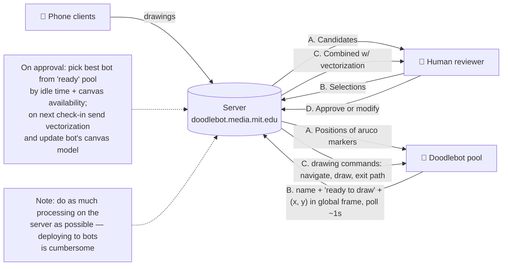
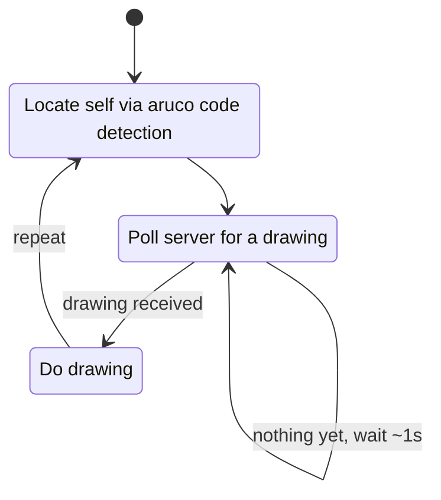
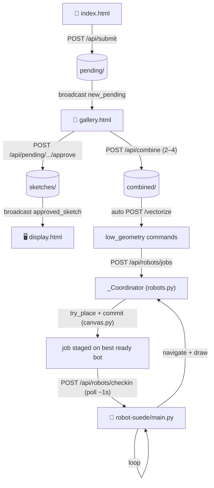

# doodlebot-ai-live

**Main architecture (data flow):**

**Doodlebot state machine:**

---

## Repository layout

The repo is composed of independently-deployed [git subrepos](https://github.com/ingydotnet/git-subrepo):

| Subrepo | Role |
| --- | --- |
| [server-suede/](server-suede/) | FastAPI server — the brain. Submission, moderation, combine, vectorization, and robot orchestration. |
| [client-suede/](client-suede/) | Static HTML front-ends (phone, gallery, display, robot admin). Served by the server, deployed via GitHub Pages. |
| [robot-suede/](robot-suede/) | The Python client flashed onto each Doodlebot (the `Locate → Poll → Draw` loop; hardware is stubbed). |
| [shared-suede/](shared-suede/) | Shared assets/tooling. |

The server wires every router together in [server-suede/app.py](server-suede/app.py); the front-end pages are served (and cached from GitHub Pages) by [server-suede/pages.py](server-suede/pages.py). All server state is in-memory plus three on-disk folders: `pending/`, `sketches/`, `combined/` (see [config.py](server-suede/config.py)).

---

## End-to-end walkthrough

The whole system is one big loop: phones feed drawings in, a human curates and combines them, the result is vectorized and queued, a robot draws it, and the canvas fills until it's reset. Each numbered stage below names the exact code.

### 1. Submit — a phone posts a drawing (`/`)
A visitor draws on the phone page [client-suede/index.html](client-suede/index.html) and `POST`s a base64 PNG to **`/api/submit`** ([submit.py](server-suede/submit.py)). The server saves `sketch_<ts>.png` + a `.json` sidecar into `pending/`, then calls `broadcast("new_pending", …)` ([common.py](server-suede/common.py)) so every connected screen sees it instantly.

### 2. Live fan-out (SSE)
All front-ends subscribe to **`/stream`** ([stream.py](server-suede/stream.py)) via `EventSource`. The broadcast broker in [common.py](server-suede/common.py) pushes server-sent events (`new_pending`, `approved_sketch`, `selection_changed`, `combining`, `combined`, `deleted_sketch`) to each listener queue. This is how the gallery and [display.html](client-suede/display.html) update without polling.

### 3. Moderate — approve or reject (`/gallery`)
A curator opens [client-suede/gallery.html](client-suede/gallery.html) (admin-token gated). It lists the queue from **`/api/pending`** and approves via **`/api/pending/{filename}/approve`** ([moderation.py](server-suede/moderation.py)), which moves the file `pending/ → sketches/`, flips its status to `approved`, and broadcasts `approved_sketch`. The big-screen [display.html](client-suede/display.html) listens for that event and shows the sketch.

### 4. Select + Combine
In the gallery the curator selects 2–4 approved sketches (`POST /api/select` → `selection_changed`) and hits **Combine**. `combineSelected()` posts to **`/api/combine`** ([combine.py](server-suede/combine.py)), which feeds the chosen images + a prompt to one or more image models (OpenAI / Gemini, via [llms.py](server-suede/llms.py)), saves the result into `combined/`, and returns it as base64. `combining`/`combined` events bracket the work.

### 5. Eager vectorization
The moment a combined image renders, the gallery **automatically** vectorizes it — no button press. `buildResultCard() → startVectorization()` in [gallery.html](client-suede/gallery.html) shows a spinner and `POST`s the image to **`/vectorize`** ([vectorize.py](server-suede/vectorize.py)). That runs `default_pipeline()` from the [arc_line_vectorization_suede/](server-suede/arc_line_vectorization_suede/) package, turning raster ink into a `DrawingCommand` list (`line`/`spin`/`arc`). The response includes `low_geometry` (the consolidated commands a robot will actually draw) and `low_geometry_svg`; the gallery renders **only** the low-geometry SVG and reveals a **Publish to Robot** button.

### 6. Publish — enqueue a drawing job
`publishToRobot()` in [gallery.html](client-suede/gallery.html) `POST`s the `low_geometry` commands to **`/api/robots/jobs`** ([robots.py](server-suede/robots.py) `post_job` → `enqueue_drawing()`). This wraps the commands in a `DrawingJob` and hands it to the in-memory `_Coordinator`. *(An admin can do the same by hand from [robots.html](client-suede/robots.html).)*

### 7. Placement + robot selection (server-side, the algorithm-heavy part)
`coordinator.enqueue()` runs `_assign_locked()` ([robots.py](server-suede/robots.py)), which is where the matchmaking happens:
- It computes the drawing's footprint once (`commands_to_strokes`, then strips the pen-up lead-in via `split_lead_in`) and caches it (`FootprintCache`) — all in [canvas.py](server-suede/canvas.py).
- It ranks the **ready** bot pool (most idle, most free region) and calls `Region.try_place()` for the best candidate. Placement rasterizes the footprint into the region's **occupancy grid** and finds a collision-free pose via **FFT cross-correlation** (`_free_offsets`), rotating the drawing for a tighter fit (`bottom_left` packs densely; `scatter` spreads organically). It never overlaps existing ink.
- On success it `commit()`s the footprint to the grid (reserving the space) and **stages** the job on the chosen bot's record. Canvases, regions, markers, and per-region occupancy are all owned by the server's `CanvasStore` and configured via **`/api/robots/canvases`**.

The drawing is now reserved for a specific robot — but not yet delivered (the bot must poll for it).

### 8. The robot loop — Locate → Poll → Draw
Each Doodlebot runs [robot-suede/main.py](robot-suede/main.py) (`run()`), the client half of the protocol:
- **Locate** — `fetch_markers()` (`GET /api/robots/markers`) returns the canvas's aruco positions; the bot solves its global pose (`estimate_pose`, a hardware stub).
- **Poll** — ~once a second it `POST`s to **`/api/robots/checkin`** with its name/status/pose. The coordinator's `check_in()` ([robots.py](server-suede/robots.py)) replies `wait`, or — if a job is staged for this bot — `draw` with `navigateTo` (the first ink point + approach heading) and the lead-in-stripped `commands`.
- **Draw** — the bot drives to `navigateTo` (`navigate_to`) and runs the commands (`execute_commands`); both are hardware stubs on the client. The server-side placement guarantees the path won't collide with anything already on the canvas.

Because delivery is pull-based, a freshly-staged job reaches the robot on its next poll (≤ ~1 s); the placement compute itself is ~10–155 ms (see commit history / `canvas.py`).

### 9. Loop
After drawing, the bot returns to **Locate** and the whole cycle repeats. New submissions keep arriving (1), curators keep combining (3–4), and the coordinator keeps packing drawings into each robot's region until it saturates — at which point regions can be reset by re-posting a canvas to **`/api/robots/canvases`**.

### Admin orchestration (`/robots`)
[client-suede/robots.html](client-suede/robots.html) is the operator console over [robots.py](server-suede/robots.py): live robot-pool + queue inspection (`GET /api/robots`), a to-scale canvas/occupancy visualizer (`GET /api/robots/canvases`), the canvas/region/marker editor (`POST /api/robots/canvases`), and a test-drawing enqueuer (`POST /api/robots/jobs`).

